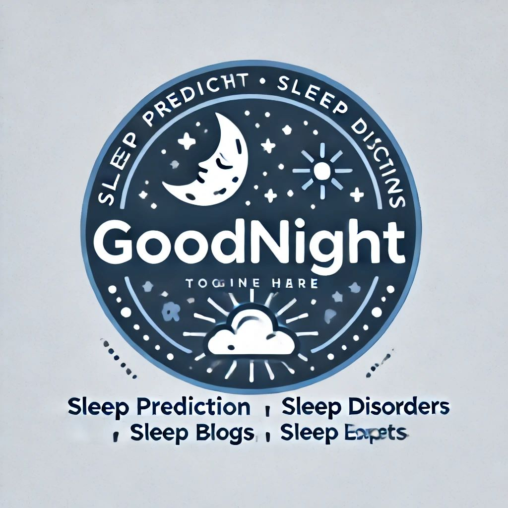
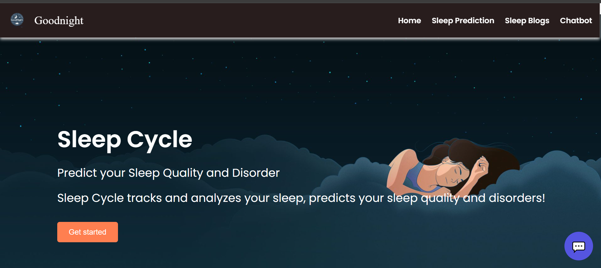
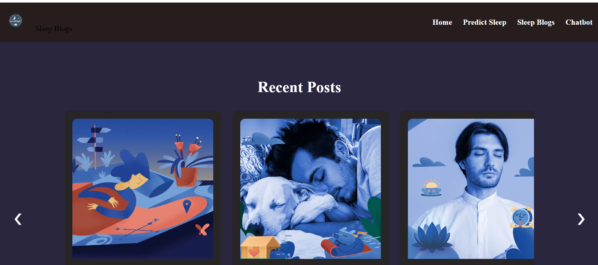
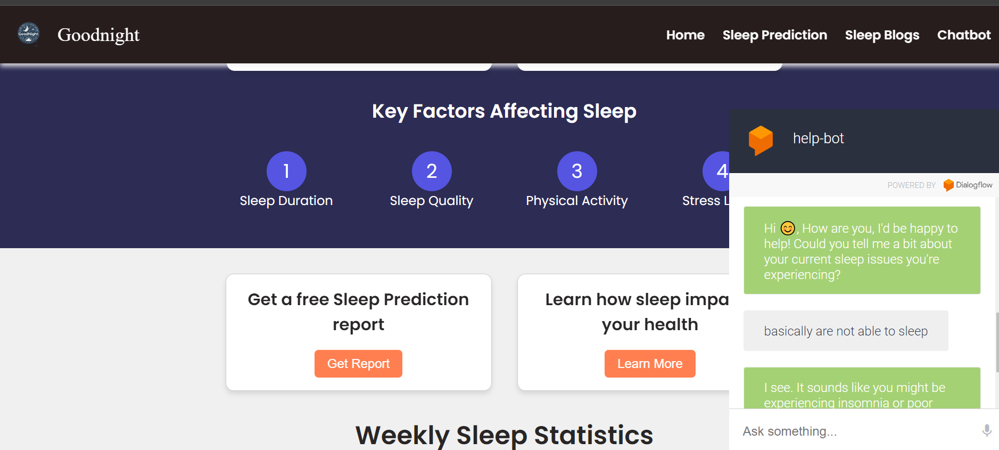
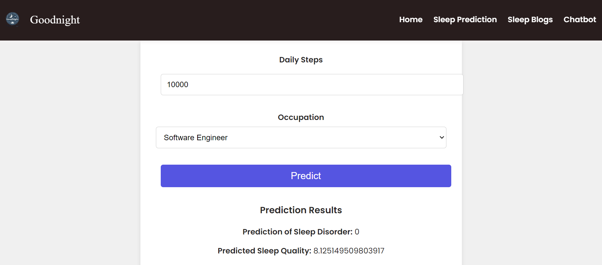

# GoodNight! Welcome to Goodnight! Where "Sleep Transforms Lives!"

GoodNight is a comprehensive solution designed to enhance sleep quality through the integration of ML predictions and personalized AI chat support. Our mission is to transform the way individuals approach their nighttime routines, fostering healthier sleep habits for all.

## 💻 Toolchain

1. **Frontend**: HTML, CSS, JavaScript, Python
2. **Backend**: Flask
3. **Libraries**: Pandas, Numpy, Plotly
4. **APIs**: Flask API for backend integration
5. **Other**: Dialogflow for AI-driven chat support 

## 🚀 Features

- **Personalized Sleep Insights**: Leveraging ML models for custom sleep quality assessments and disorder predictions.
- **AI-Driven Chat Support**: Immediate and reliable assistance for user inquiries, powered by Dialogflow through text and microphone.
- **Seamless User Experience**: An intuitive interface featuring secure login and personalized profile settings.
- **Sleep Blogs**: Providing customized sleep advice through articles.
- **Community Support**: A collaborative platform for users to share experiences and obtain expert advice.

## 📷 Screenshots

## 📖 Documentation

For more details on how to use GoodNight, refer to our [Documentation](link_to_documentation).

